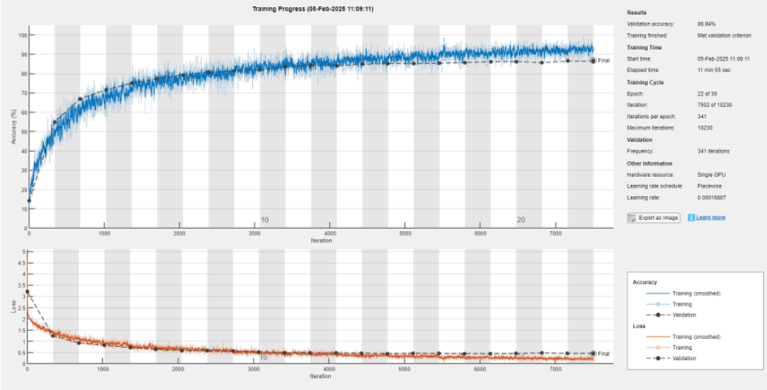
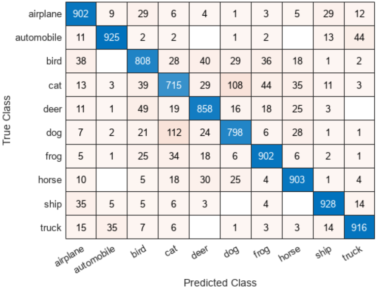
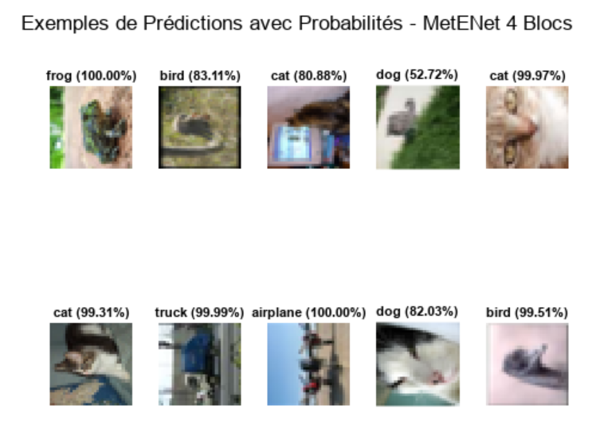
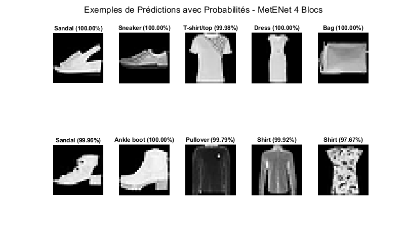
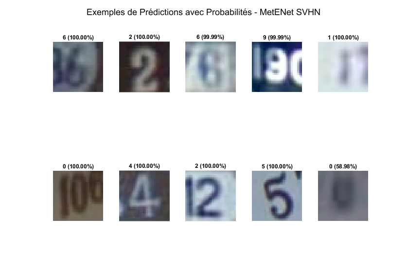

MetENet-CNN-Image-Classification
Custom CNN for image classification on CIFAR-10, with cross-validation, benchmark comparison and generalization on Fashion-MNIST and SVHN.
# MetENet — CNN Image Classification for Object Recognition

## Overview

This project focuses on **image classification using Convolutional Neural Networks (CNNs)** for object recognition.

A custom CNN architecture named **MetENet** was designed, trained and evaluated on the **CIFAR-10 dataset**.

The project explores the complete machine-learning workflow, including:

- dataset analysis and preprocessing,
- CNN architecture design,
- model optimization,
- training and validation,
- performance evaluation,
- cross-validation,
- comparison with well-known CNN architectures,
- and generalization on additional datasets.

The objective was to develop a CNN capable of achieving competitive classification performance while maintaining a relatively efficient architecture.

---

## Project Context

This work was developed as an academic integrative project during the **2024–2025 academic year**.

**Developed by:**  
Eya Sahli & Montassar Laboudi

**Supervisor:**  
Ahcen Aliouet

The project focuses on:

- Deep Learning
- Computer Vision
- Image Classification
- Convolutional Neural Networks
- Model Optimization
- Performance Evaluation

---

## Dataset — CIFAR-10

The main dataset used in this project is **CIFAR-10**.

CIFAR-10 contains **60,000 RGB images** of size **32 × 32 pixels**, distributed across 10 object categories:

- Airplane
- Automobile
- Bird
- Cat
- Deer
- Dog
- Frog
- Horse
- Ship
- Truck

The dataset is balanced across the different classes.

---

## Dataset Split

Two validation strategies were evaluated.

### Classical Train / Validation / Test Split

The dataset was divided as follows:

- **70% Training**
- **10% Validation**
- **20% Testing**

### 5-Fold Cross-Validation

A second evaluation was performed using **5-fold cross-validation**.

The model was trained five times, with four folds used for training and one fold used for validation during each iteration.

The resulting accuracies were:

| Fold | Accuracy |
|---|---:|
| Fold 1 | 86.64% |
| Fold 2 | 86.64% |
| Fold 3 | 87.05% |
| Fold 4 | 86.32% |
| Fold 5 | 86.44% |
| **Average** | **86.62%** |

The standard dataset split achieved an accuracy of **86.55%**, showing very similar performance between both evaluation strategies.

---

## MetENet Architecture

MetENet is a custom CNN architecture inspired by the principles of deeper convolutional networks such as VGG.

Several architectures were explored during development before selecting a **four-block convolutional architecture**.

### Block 1

```text
Conv 3×3 — 32 filters
Conv 3×3 — 32 filters
Batch Normalization
ReLU
Max Pooling 2×2
```

### Block 2

```text
Conv 3×3 — 64 filters
Conv 3×3 — 64 filters
Batch Normalization
ReLU
Max Pooling 2×2
```

### Block 3

```text
Conv 3×3 — 128 filters
Conv 3×3 — 128 filters
Batch Normalization
ReLU
Max Pooling 2×2
```

### Block 4

```text
Conv 3×3 — 256 filters
Conv 3×3 — 256 filters
Batch Normalization
ReLU
Max Pooling 2×2
```

The progressive increase in the number of filters allows the network to learn increasingly complex image representations.

Early layers mainly detect low-level characteristics such as edges and textures, while deeper layers capture more complex visual patterns.

---

## Regularization

Dropout was introduced to reduce overfitting.

Different dropout rates were used depending on the depth of the network:

| Layer | Dropout |
|---|---:|
| Block 1 | 0.10 |
| Block 2 | 0.20 |
| Block 3 | 0.30 |
| Block 4 | 0.30 |
| Fully Connected Layer | 0.35 |

This progressive regularization strategy helps preserve low-level feature learning in the first layers while applying stronger regularization to deeper representations.

---

## Training Strategy

The network was trained using the **Adam optimizer**.

Several parameters were adjusted during the optimization phase, including:

- learning rate,
- number of epochs,
- mini-batch size,
- validation frequency,
- dropout rate,
- number of convolutional blocks,
- number of filters.

An **early stopping mechanism** was also used to reduce unnecessary training once validation performance stopped improving.

---

## Training Performance

The selected MetENet configuration reached approximately **86.55% classification accuracy on CIFAR-10**.

<p align="center">
  
</p>

The training curves show progressive improvement in classification accuracy together with a reduction in the loss function.

---

## Confusion Matrix

The confusion matrix provides a detailed view of the model's classification behavior across all CIFAR-10 classes.

<p align="center">
  
</p>

Strong classification performance can be observed for classes such as:

- automobile,
- airplane,
- frog,
- horse,
- ship,
- truck.

Some confusion remains between visually similar categories such as **cat and dog**, which represents a common challenge on CIFAR-10.

---

## Prediction Examples

The following examples show predictions generated by MetENet together with their confidence probabilities.

<p align="center">
  
</p>

---

## Comparison with Reference CNN Architectures

MetENet was compared with several widely used CNN architectures.

| Model | Accuracy | F1-Score | Error Rate | Training Time |
|---|---:|---:|---:|---:|
| AlexNet | 80.07% | 80.07% | 19.93% | 14 min 11 s |
| SqueezeNet | 85.79% | 85.79% | 14.21% | 14 min 53 s |
| **MetENet** | **86.55%** | **86.55%** | **13.45%** | **11 min 55 s** |
| GoogLeNet | 87.79% | 87.79% | 12.21% | 31 min 53 s |
| MobileNetV2 | 90.91% | 90.91% | 9.09% | 364 min 11 s |
| ResNet18 | 91.80% | 91.80% | 8.20% | 17 min 59 s |

The results show that MetENet provides competitive performance while maintaining a relatively efficient training time in the experimental environment.

---

## Training from Scratch

A second comparison was performed by training selected architectures entirely from scratch.

| Model | Accuracy |
|---|---:|
| AlexNet | 76.79% |
| SqueezeNet | 83.36% |
| GoogLeNet | 84.20% |
| **MetENet** | **86.55%** |
| ResNet18 | 90.68% |

In this experiment, MetENet achieved higher accuracy than AlexNet, SqueezeNet and GoogLeNet.

---

# Generalization to Other Datasets

To evaluate whether the architecture could generalize beyond CIFAR-10, MetENet was also evaluated on additional image datasets.

---

## Fashion-MNIST

Fashion-MNIST contains **70,000 grayscale images** of clothing items distributed across 10 classes.

MetENet achieved:

## **92.72% Accuracy**

Example predictions:

<p align="center">
  
</p>

These results show that the architecture is capable of extracting useful features from a dataset with visual characteristics significantly different from CIFAR-10.

---

## Street View House Numbers — SVHN

The **SVHN dataset** contains real-world images of house numbers captured from Google Street View.

Compared with CIFAR-10 and Fashion-MNIST, the images may contain additional challenges such as:

- blur,
- illumination variations,
- real-world backgrounds,
- class imbalance.

MetENet achieved:

## **95.3941% Accuracy**

Example predictions:

<p align="center">
  
</p>

The results demonstrate the ability of the model to generalize to a different image-recognition problem involving real-world digit images.

---

## Key Results

| Experiment | Accuracy |
|---|---:|
| CIFAR-10 — Standard Split | **86.55%** |
| CIFAR-10 — 5-Fold Cross-Validation | **86.62%** |
| Fashion-MNIST | **92.72%** |
| SVHN | **95.3941%** |

---

## Tools & Technologies

| Area | Technologies |
|---|---|
| Deep Learning | Convolutional Neural Networks |
| Development | MATLAB |
| Optimization | Adam |
| Validation | Train/Validation/Test, 5-Fold Cross-Validation |
| Evaluation | Accuracy, Precision, Recall, F1-Score, Confusion Matrix |
| Computer Vision | Image Classification, Object Recognition |
| Datasets | CIFAR-10, Fashion-MNIST, SVHN |
| Hardware | NVIDIA GPU |

---

## Skills Demonstrated

- Deep Learning
- Convolutional Neural Networks
- Computer Vision
- Image Classification
- CNN Architecture Design
- Hyperparameter Optimization
- Cross-Validation
- Model Evaluation
- Confusion Matrix Analysis
- MATLAB
- Experimental Analysis
- Scientific Documentation

---

## Conclusion

The project resulted in the development of **MetENet**, a custom CNN architecture designed for image classification.

The model achieved **86.55% accuracy on CIFAR-10** and showed consistent performance through **5-fold cross-validation with an average accuracy of 86.62%**.

The comparison with established CNN architectures showed competitive performance, particularly when considering training efficiency.

The additional experiments on **Fashion-MNIST (92.72%)** and **SVHN (95.3941%)** demonstrated that the architecture can also generalize to datasets with substantially different visual characteristics.

---

## Future Work

Possible extensions of this work include:

- additional architecture optimization,
- data augmentation strategies,
- automated hyperparameter optimization,
- lightweight deployment on embedded platforms,
- model compression and quantization,
- real-time image classification,
- evaluation on additional real-world datasets.

---

## Repository Structure

This repository contains the MATLAB implementation of the MetENet project together with selected experimental results and visualizations.

```text
MetENet-CNN-Image-Classification-MATLAB-Python/
│
├── src/
│   └── MATLAB source code
│
├── figures/
│   ├── training-progress.png
│   ├── cifar10-confusion-matrix.png
│   ├── cifar10-predictions.png
│   ├── fashion-mnist-predictions.png
│   └── svhn-predictions.png
│
└── README.md

---

## Authors

**Eya Sahli**  **Montassar Laboudi**
Signal Processing, Embedded Systems & AI Engineer
